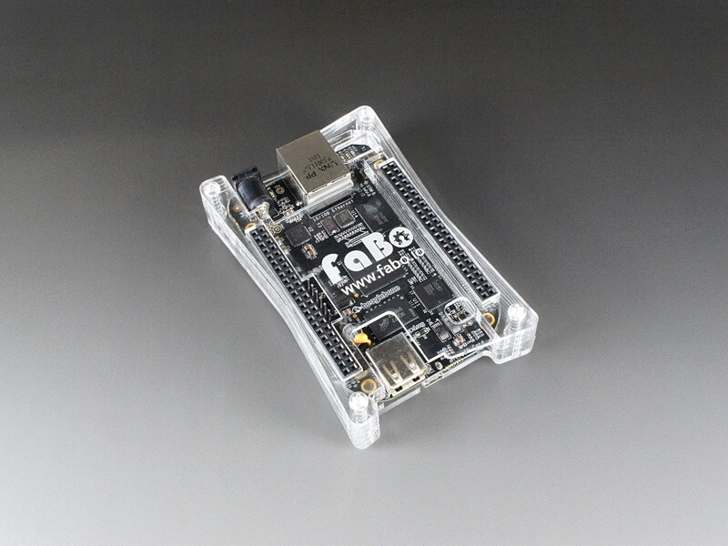
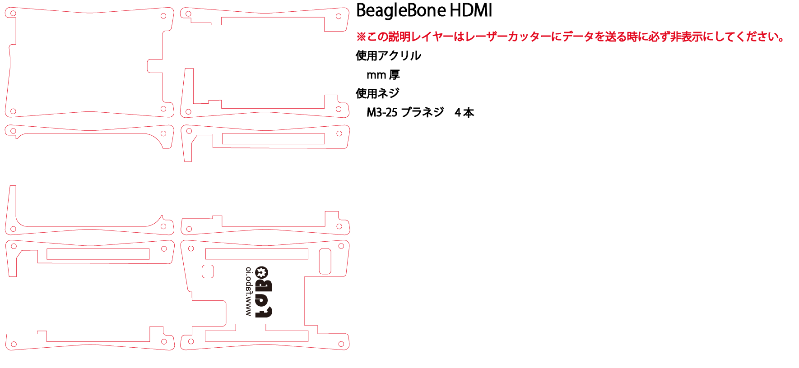
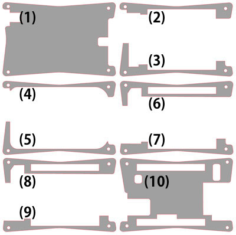
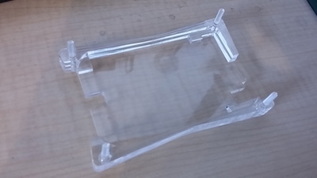
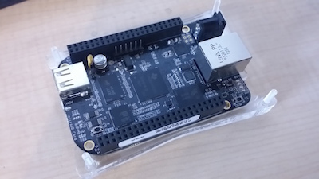

# #1112 BeagleBoneケース

<!--COLORME-->

**注文を受けてから生産しますので、納期にお時間をいただく場合があります。**

## Overview
BeagleBone用のアクリル製ケースです。

## 図面

**ケースのデザインは予告なく変更される場合があります。**

**マニュアルで使われている写真のパーツと、実際のパーツの色や形が異なる場合があります。あらかじめご了承ください。**

※HDMI出力有り版です。

## パーツ構成

パーツが細い部分があります。折れないように取り扱いには十分気を付けてください。

## 組み立て方法
1.　下から(1)、(2)、(3)を順番に重ねます。
組み立て易くする為に、下から四方の穴にネジを差し込んでおきます。

2.　(2)の上に(4)、(3)の上に(5)を重ねます。

3.　(4)と(5)にハメ込むようにボードをセットします。

(2)と(3)の上に乗る形になります。

4.　(4)の上に(6)、(8)の順に重ねます。

(6)と(8)は同じ形なのでどちらが先でも構いません。

5.　(5)の上に(7)、(9)の順に重ねます。

(7)と(9)は同じ形なのでどちらが先でも構いません。

6.　(10)を重ねます。

7.　ネジをナットで固定します。ネジの方向は使用環境に応じて変えてください。

ゴムクッションはお好みでお使いください。

ネジが長いと感じる方はニッパーなどでカットしてください。
