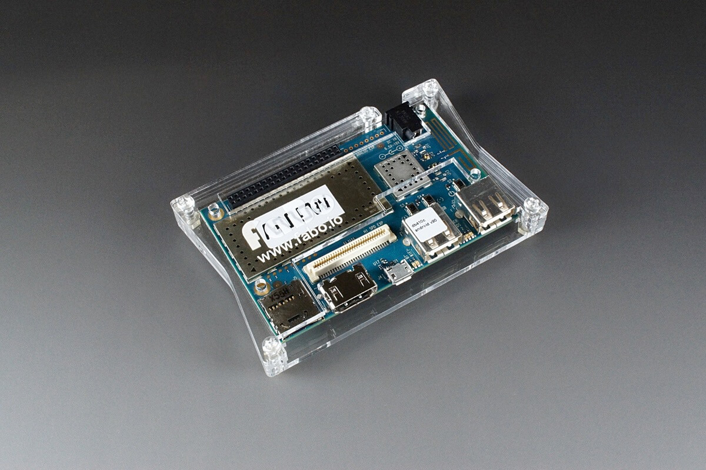
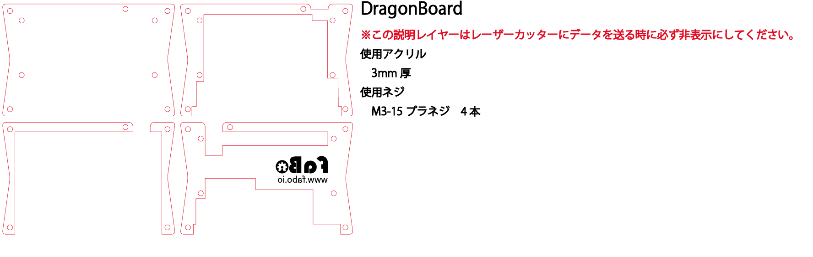
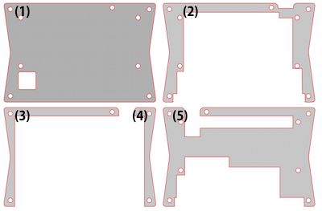
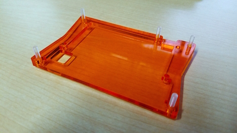
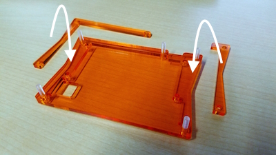
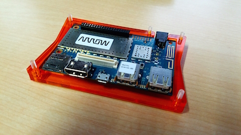
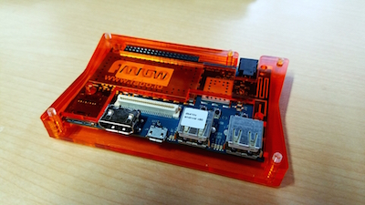

# #1114 DragonBoardケース

<!--COLORME-->

**注文を受けてから生産しますので、納期にお時間をいただく場合があります。**

## Overview
DragonBoard用のアクリル製ケースです。

## 図面

**ケースのデザインは予告なく変更される場合があります。**

**マニュアルで使われている写真のパーツと、実際のパーツの色や形が異なる場合があります。あらかじめご了承ください。**

## パーツ構成

使用ネジはM3-15プラネジ5本です。

## 組み立て方法

1.下から(1)、(2)を順番に重ねます。

組み立て易くする為に、下から四方の穴にネジを差し込んでおきます。

ナットでの固定はしません。

2.(3)、(4)を取り付けます。

3.(3)と(4)に挟むようにボードをセットします。

4.(5)を取り付けます。

5.ネジをナットで固定します。ネジの方向は使用環境に応じて変えてください。

ゴムクッションはお好みでお使いください。

ネジが長いと感じる方はニッパーなどでカットしてください。
