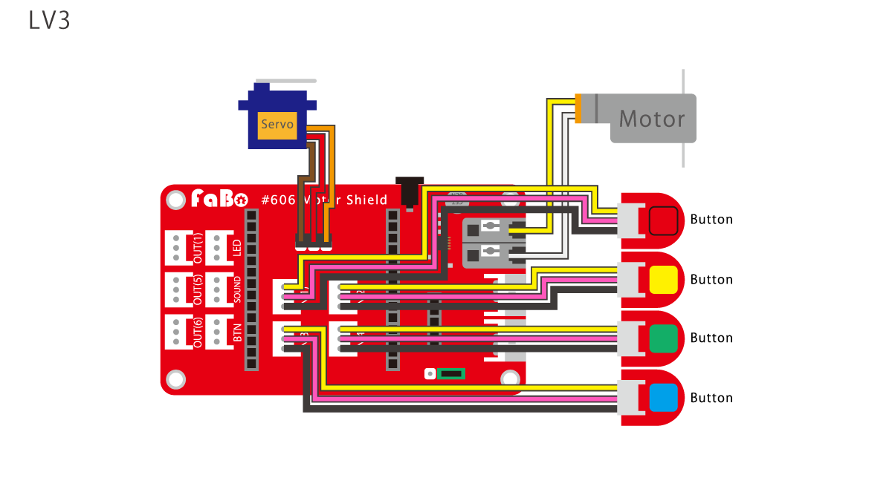

# イチゴジャム

### レベル１

配線図

モーターを前進・後退させます。

### ソースコード

前進・後退を繰り返す。
~~~~
10 OUT(3),1:WAIT 120
20 OUT(3),0:WAIT 60
30 OUT(4),1:WAIT 120
40 OUT(4),0:WAIT 60
50 GOTO 10
~~~~
説明

>10 OUT(3),1:WAIT 120

２秒間、前に進む。 

>20 OUT(3),0:WAIT 60

１秒間、停止する。

>30 OUT(4),1:WAIT 120

２秒間、後ろにさがる。

>40 OUT(4),0:WAIT 60

１秒間、停止する。

>50 GOTO 10

１０行目に飛ぶ。（ループさせる）

### --- 注意　---

OUT(3)とOUT(4)の動作コマンドは同時に実行できません。

前進と後退が反対に実行されたら、それはモーターの配線が逆になっています。

### レベル２

配線図

ボタンで前進・後退させます。

ボタンが押されていない場合、１（クローズ）を返します。ボタンが押されると０（オープン）を返します。

### ソースコード

IN(3)に挿したボタンを押すと前進、IN(4)に挿したボタンを押すと後退します。
~~~~
10 A=IN(3):B=IN(4)
20 IF A=0 AND B=1 OUT(3),1
30 IF A=1 AND B=0 OUT(4),1
40 IF A=1 AND B=1 OUT(3),0:OUT(4),0
50 GOTO 10
~~~~
説明

>10 A=IN(3):B=IN(4)

変数AにIN(3)、変数Bに(4)の値を代入する。

>20 IF A=0 AND B=1 OUT(3),1

IN(3)ボタンが押されていて、IN(4)ボタンが押されていないなら前進する。

>30 IF A=1 AND B=0 OUT(4),1

IN(3)ボタンが押されいない、IN(4)ボタンが押されているなら後退する。

>40 IF A=1 AND B=1 OUT(3),0:OUT(4),0

IN(3)ボタンとIN(4)ボタンが押されていないならモーターを停止する。

>50 GOTO 10

１０行目に飛ぶ。（ループさせる）

### --- 注意　---

IN(3)ボタンとIN(4)ボタンを同時に押しても条件文（IF文）が無いので動作しません。

### レベル３

配線図

ボタンで前輪の向きを変えます。

ボタンが押されていない場合、１（クローズ）を返します。ボタンが押されると０（オープン）を返します。

### ソースコード

IN(1)に挿したボタンを押すと左、IN(2)に挿したボタンを押すと右に前輪の向きを変えます。
~~~~
10 A=IN(3):B=IN(4)
20 C=IN(1):D=IN(2)
30 IF A=0 AND B=1 OUT(3),1
40 IF A=1 AND B=0 OUT(4),1
50 IF A=1 AND B=1 OUT(3),0:OUT(4),0
60 IF C=0 AND D=1 PWM(2),180
70 IF C=1 AND D=0 PWM(2),100
80 IF C=1 AND D=1 PWM(2),140
90 GOTO 10
~~~~
説明

>10 A=IN(3):B=IN(4)

変数AにIN(3)、変数Bに(4)の値を代入する。(レベル２と同じ）

>20 C=IN(1):D=IN(2)

変数CにIN(1)、変数Dに(2)の値を代入する。

>30 IF A=1 AND B=0 OUT(3),1

IN(3)ボタンが押されていて、IN(4)ボタンが押されていないなら前進する。(レベル２と同じ）

>40 IF A=0 AND B=1 OUT(4),1

IN(3)ボタンが押されいない、IN(4)ボタンが押されているなら後退する。(レベル２と同じ）

>50 IF A=1 AND B=1 OUT(3),0:OUT(4),0

IN(3)ボタンとIN(4)ボタンが押されていないならモーターを停止する。(レベル２と同じ）

>60 IF C=0 AND D=1 PWM(2),180

IN(1)ボタンが押されていて、IN(2)ボタンが押されていないなら前輪を左に向ける。

>70 IF C=1 AND D=0 PWM(2),100

IN(1)ボタンが押されていない、IN(2)ボタンが押されているなら前輪を右に向ける。

>80 IF C=1 AND D=1 PWM(2),140

IN(1)ボタンとIN(2)ボタンが押されていないなら前輪をまっすぐにする。

>90 GOTO 10

１０行目に飛ぶ。（ループさせる）

### --- 注意　---

IN(1)ボタンとIN(2)ボタンを同時に押しても条件文（IF文）が無いので動作しません。

