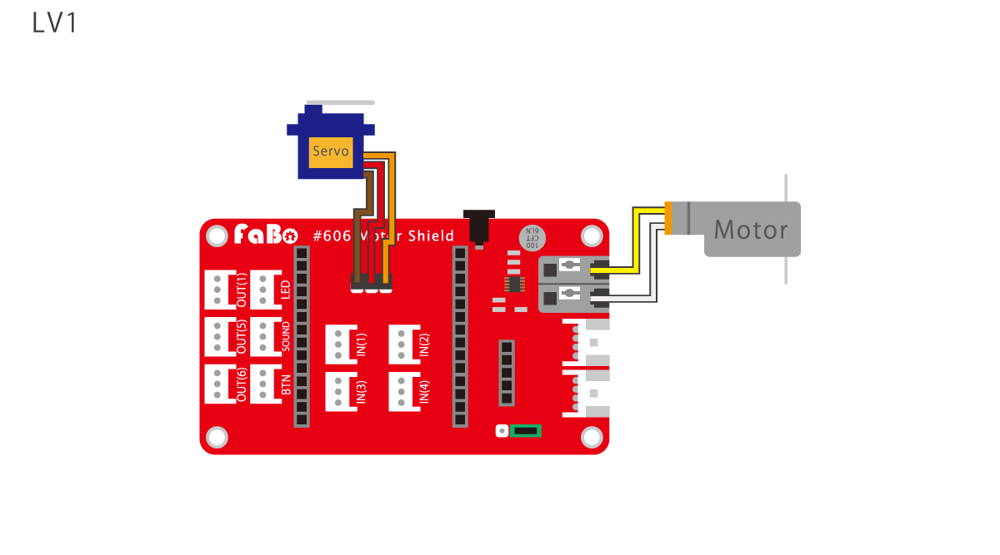
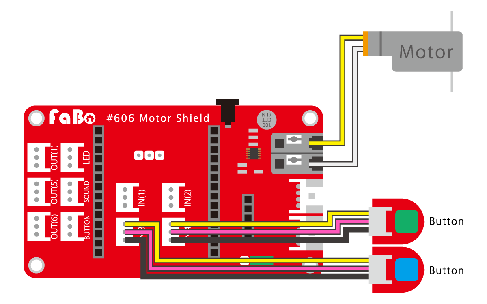

# 見出し1です
## 見出し2です
### 見出し3です
#### 見出し4です
##### 見出し5です
###### 見出し6です

### イチゴジャム

レベル１

配線図

モーターを前進・後退させます。

・前に進む

OUT(3),1

・前に進むを止める

OUT(3),0

・後ろにさがる

OUT(4),1

・後ろにさがるを止める

OUT(4),0

ソースコード

前進・後退を繰り返す。
~~~~
10 OUT(3),1:WAIT 120
20 OUT(3),0:WAIT 60
30 OUT(4),1:WAIT 120
40 OUT(4),0:WAIT 60
50 GOTO 10
~~~~
説明

--- 注意　---

OUT(3)とOUT(4)のコマンドは同時に実行できません。

前進と後退が反対に実行されたら、それはモーターの配線が逆になっています。

レベル２

配線図

モーターを前進・後退させます。

