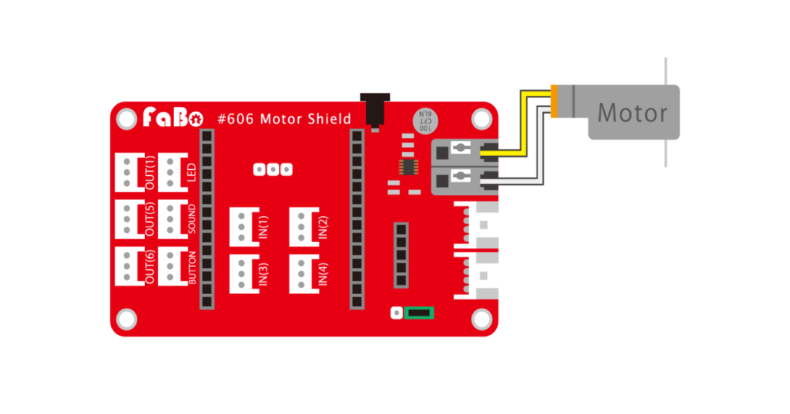
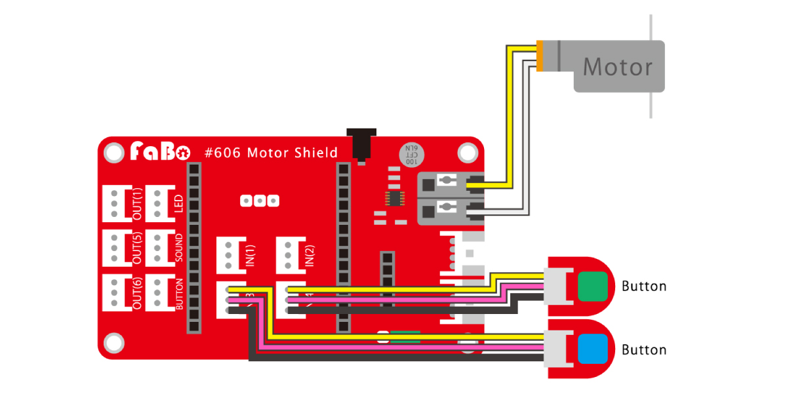
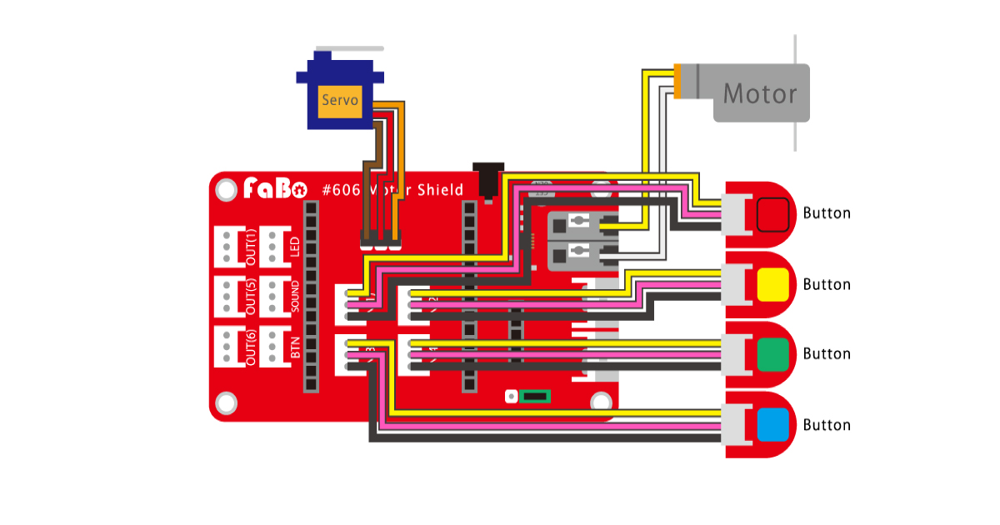
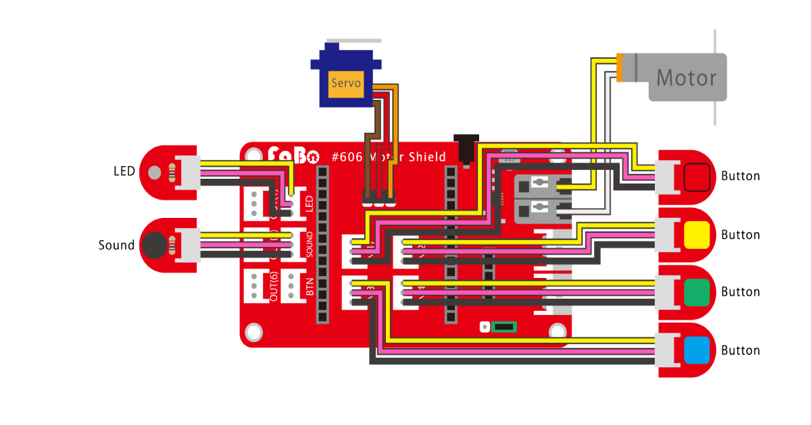
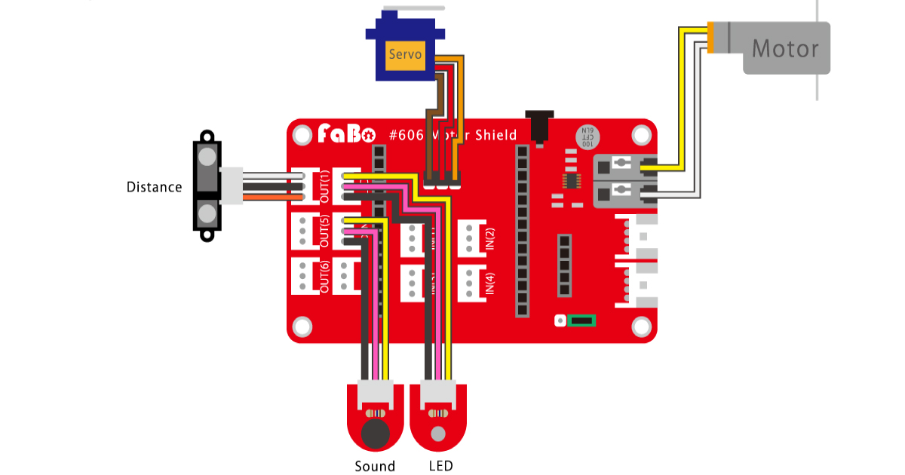
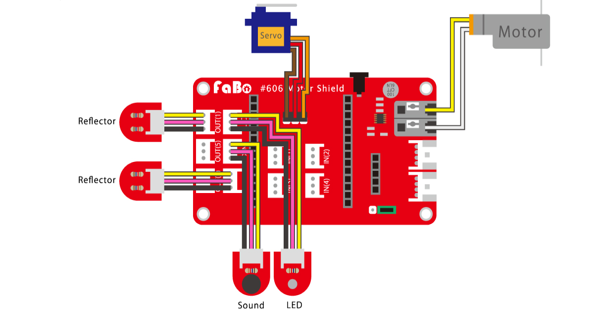

# イチゴジャムでラジコンカー（HotDog）を制御する。

仕様変更する場合があります。あらかじめこ了承ください。

### レベル１

モーターを前進・後退させます。

配線図

### ソースコード

前進・後退を繰り返す。
~~~~
10 OUT(3),1:WAIT 120
20 OUT(3),0:WAIT 60
30 OUT(4),1:WAIT 120
40 OUT(4),0:WAIT 60
50 GOTO 10
~~~~
説明

>10 OUT(3),1:WAIT 120

２秒間、前に進む。 

>20 OUT(3),0:WAIT 60

１秒間、停止する。

>30 OUT(4),1:WAIT 120

２秒間、後ろにさがる。

>40 OUT(4),0:WAIT 60

１秒間、停止する。

>50 GOTO 10

１０行目に飛ぶ。（ループさせる）

### --- 注意 ---

OUT(3)とOUT(4)の動作コマンドは同時に実行できません。

前進と後退が反対に実行されたら、それはモーターの配線が逆になっています。

### レベル２

ボタンで前進・後退させます。

配線図

ボタンが押されていない場合、１（クローズ）を返します。ボタンが押されると０（オープン）を返します。

### ソースコード

IN(3)に挿したボタンを押すと前進、IN(4)に挿したボタンを押すと後退します。
~~~~
10 A=IN(3):B=IN(4)
20 IF A=0 AND B=1 OUT(3),1
30 IF A=1 AND B=0 OUT(4),1
40 IF A=1 AND B=1 OUT(3),0:OUT(4),0
50 GOTO 10
~~~~
説明

>10 A=IN(3):B=IN(4)

変数AにIN(3)、変数Bに(4)の値を代入する。

>20 IF A=0 AND B=1 OUT(3),1

IN(3)ボタンが押されていて、IN(4)ボタンが押されていないなら前進する。

>30 IF A=1 AND B=0 OUT(4),1

IN(3)ボタンが押されいない、IN(4)ボタンが押されているなら後退する。

>40 IF A=1 AND B=1 OUT(3),0:OUT(4),0

IN(3)ボタンとIN(4)ボタンが押されていないならモーターを停止する。

>50 GOTO 10

１０行目に飛ぶ。（ループさせる）

### --- 注意 ---

IN(3)ボタンとIN(4)ボタンを同時に押しても条件文（IF文）が無いので動作しません。

### レベル３

ボタンで前輪の向きを変えます。

配線図

ボタンが押されていない場合、１（クローズ）を返します。ボタンが押されると０（オープン）を返します。

### ソースコード

IN(1)に挿したボタンを押すと左、IN(2)に挿したボタンを押すと右に前輪の向きを変えます。
~~~~
10 A=IN(3):B=IN(4)
20 C=IN(1):D=IN(2)
30 IF A=0 AND B=1 OUT(3),1
40 IF A=1 AND B=0 OUT(4),1
50 IF A=1 AND B=1 OUT(3),0:OUT(4),0
60 IF C=0 AND D=1 PWM(2),180
70 IF C=1 AND D=0 PWM(2),100
80 IF C=1 AND D=1 PWM(2),140
90 GOTO 10
~~~~
説明

>20 C=IN(1):D=IN(2)

変数CにIN(1)、変数Dに(2)の値を代入する。

>60 IF C=0 AND D=1 PWM(2),180

IN(1)ボタンが押されていて、IN(2)ボタンが押されていないなら前輪を左に向ける。

>70 IF C=1 AND D=0 PWM(2),100

IN(1)ボタンが押されていない、IN(2)ボタンが押されているなら前輪を右に向ける。

>80 IF C=1 AND D=1 PWM(2),140

IN(1)ボタンとIN(2)ボタンが押されていないなら前輪をまっすぐにする。

>90 GOTO 10

１０行目に飛ぶ。（ループさせる）

### --- 注意 ---

IN(1)ボタンとIN(2)ボタンを同時に押しても条件文（IF文）が無いので動作しません。

### レベル4

前進時にLEDの点灯、後退時に警告音を鳴らします。

配線図

### ソースコード

~~~~
10 PLAY""
20 A=IN(3):B=IN(4)
30 C=IN(1):D=IN(2)
40 IF A=0 AND B=1 OUT(3),1:LED 1
50 IF A=1 AND B=0 OUT(4),1:IF SOUND()=0 PLAY"BR"
60 IF A=1 AND B=1 OUT(3),0:OUT(4),0:LED 0
70 IF C=0 AND D=1 PWM(2),180
80 IF C=1 AND D=0 PWM(2),100
90 IF C=1 AND D=1 PWM(2),140
100 GOTO 20
~~~~
説明

>10 PLAY""

サウンド初期化

>40 IF A=0 AND B=1 OUT(3),1:LED 1

IN(3)ボタンが押されていて、IN(4)ボタンが押されていないならLEDを点灯させながら前進する。

>50 IF A=1 AND B=0 OUT(4),1:IF SOUND( )=0 PLAY"BR"

IN(3)ボタンが押されいない、IN(4)ボタンが押されているなら警告音を鳴らしながら後退する。

>60 IF A=1 AND B=1 OUT(3),0:OUT(4),0:LED 0

IN(3)ボタンとIN(4)ボタンが押されていないならLEDを消灯してモーターを停止する。

>100 GOTO 20

2０行目に飛ぶ。（ループさせる）

### --- 注意 ---

PLAY""を先に宣言させないと警告音が鳴らない。（Ichigojamのバージョンにより異なる）

SOUND( )はPLAYが実行されている（音がなっている）場合は１を返します。

### レベル5

距離センサーを使って衝突判定を行い、自動走行します。

目の前に障害物があると停止し、方向を変えて後退し、再びまっすぐ前進します。

配線図

### ソースコード

~~~~
10 PLAY""
20 OUT(1),-1:WAIT 120
30 OUT(3),1:PWM(2),100
40 A=ANA(5)
50 IF A>300 GOTO 100
60 GOTO 40
100 OUT(3),0:PWM(2),80
110 WAIT 60:OUT(4),1:LED 1
120 FOR I=1 TO 4
130 IF SOUND()=0 PLAY”BR”:WAIT 60
140 NEXT:LED 0
150 OUT(4),0:WAIT 60
160 GOTO 30
~~~~
説明

>20 OUT(1),-1:WAIT 120

OUT(1)ポートをANA(5)に切り替えて、２秒待つ。

>30 OUT(3),1:PWM(2),100

前輪をまっすぐにして前進をする。

>40 A=ANA(5)

変数Aに距離センサーの値を代入

>50 IF A>300 GOTO 100

距離センサーの値が３００より大きいなら１００行目へ飛ぶ。

>60 GOTO 40

４０行目へ飛ぶ。（ループさせる）

>100 OUT(3),0:PWM(2),100

前進を停止し、前輪を右に向ける。

>110 WAIT 60:OUT(4),1:LED 1

1秒待ってからLEDを点灯と同時に後退する。

>130 FOR I=1 TO 4 
>140 IF SOUND()=0 PLAY”BR”:WAIT 60 
>150 NEXT:LED 0 

警告音を４回繰り返してからLEDを消灯させる。

>150 OUT(4),0:WAIT 60

後退を停止し、１秒待つ。

>160 GOTO 30

３０行目に飛ぶ。（はじめに戻る）

### --- 注意 ---

５０行目の300の値を変更すると、衝突検知距離が変わります。

### レベル6

黒いラインに沿って走行します。

配線図

Reflector 接続ポートOUT(1) 
Reflector 接続ポートBTN 

### ソースコード

~~~~
10 X=600
20 OUT(1),-1:WAIT 120
30 OUT(3),1:PWM(2),100
40 A=ANA(0):B=ANA(5)
50 IF A<X AND B>X PWM(2),100
60 IF A>X AND B<X PWM(2),180
70 IF A<X AND B<X PWM(2),140
80 GOTO 40
~~~~
説明

>10 X=600

センサー値の設定

>40 A=ANA(0):B=ANA(5)

変数Aと変数Bに左右のセンサー値を代入する。

>50 IF A<`X AND B`>X PWM(2),100 
>60 IF A>X AND B<X PWM(2),180 
>70 IF A<X AND B<X PWM(2),140

センサーの値によって前輪の向きを変える。

>80 GOTO 40

４０行目に飛ぶ。（ループさせる）
