# Mouse

## 組み立てマニュアル

主な構成パーツ

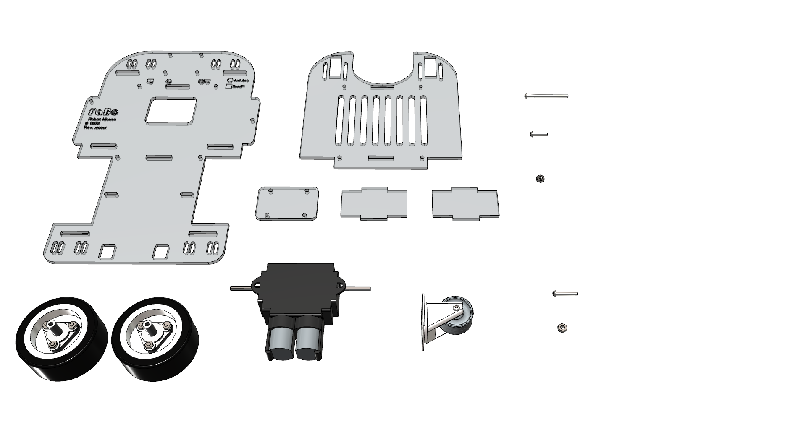

＊＊＊　注意　＊＊＊

仕様変更に伴い、構成パーツや組み立て方法が変わる場合があります。
あらかじめご了承ください。

# モーターギヤボックス前準備

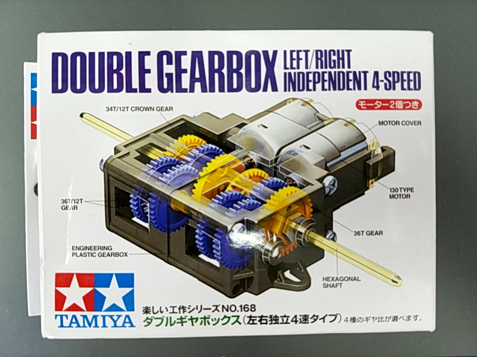

ギヤ比は 114.7 : 1　組み立てます。

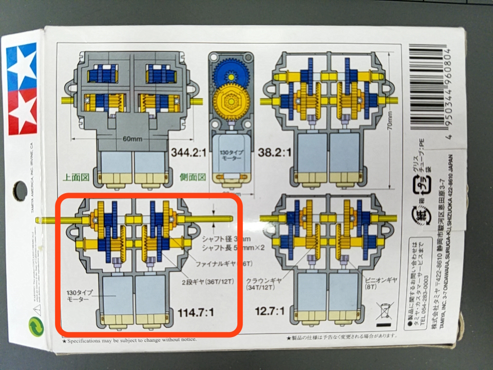

モーターは付属のモーターから、6Vモーターに取り替えます。

※２個用意します。

完成図

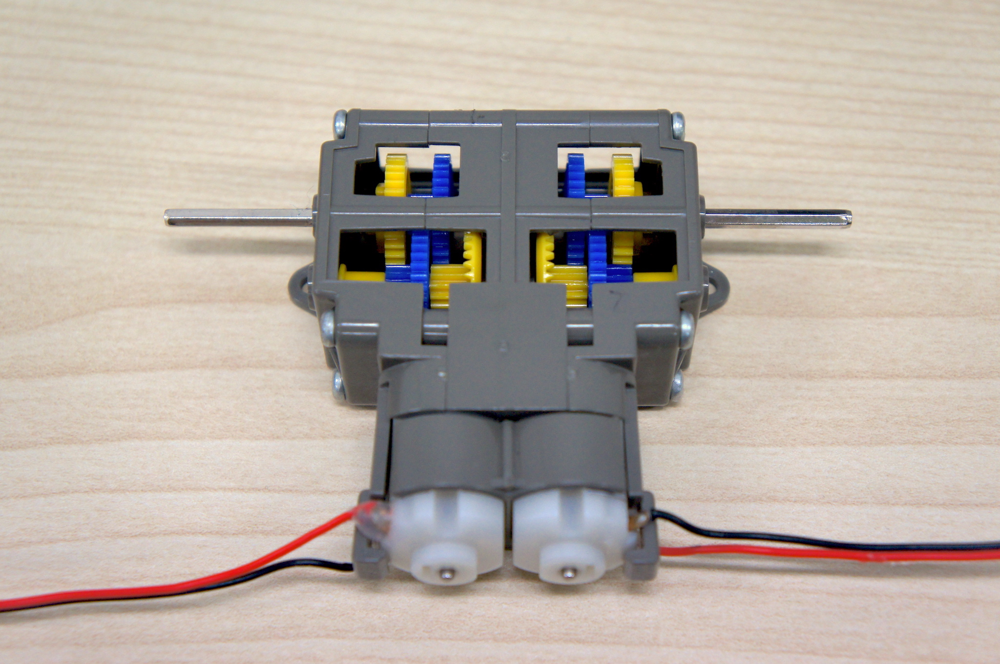

# タイヤ前準備

2個作ります。

タイヤはシャフト取り付け治具まで組み立てます。ホイール内部が浅いほうが内側になります。

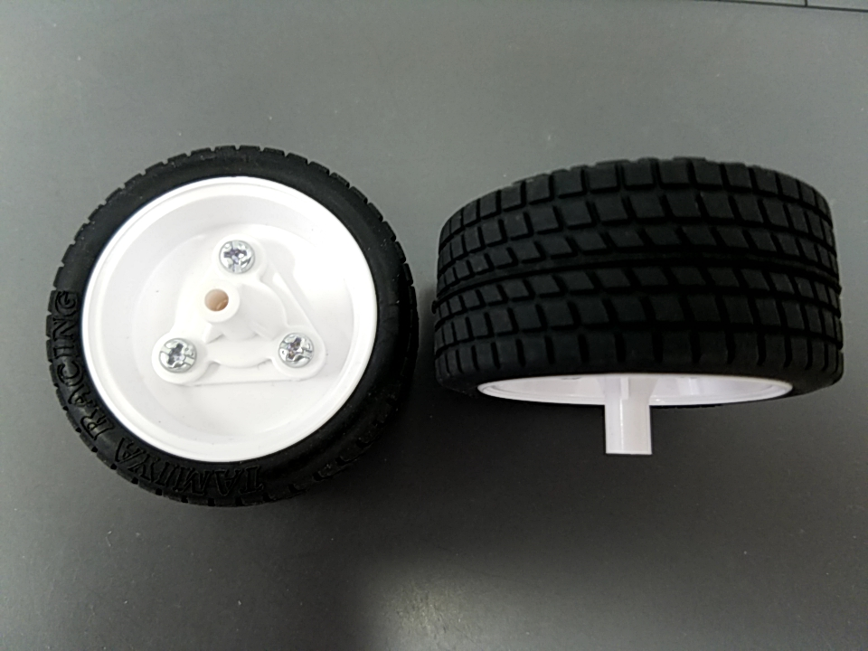

# 前キャスターの取り付け

* 使用ネジ（M3-12ｍｍ）4本

シャーシ上部、アジャスター、キャスターの順番で取り付けます。

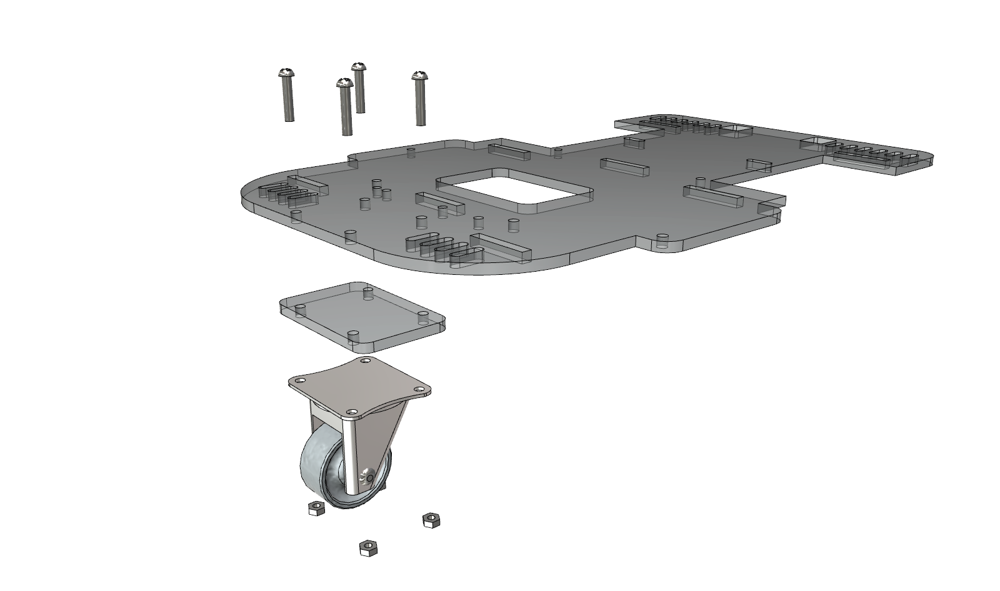

# モーターギヤの取り付け

* 使用ネジ（M3-12ｍｍ）2本

モーダーギヤの方向に注意してください。

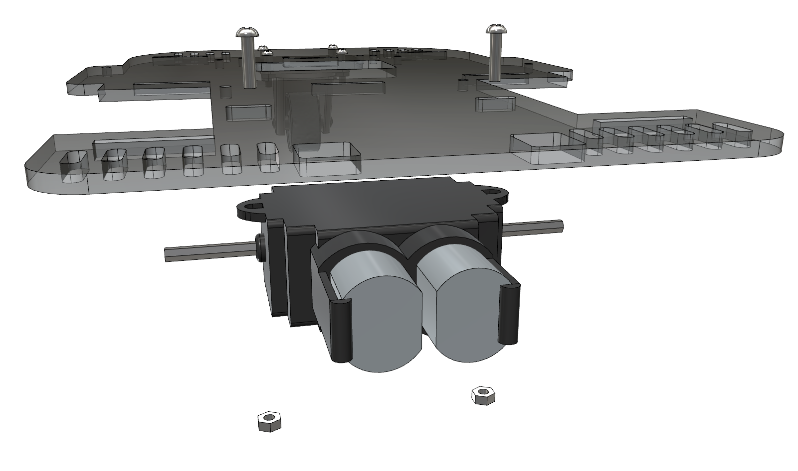

# タイヤの取り付け

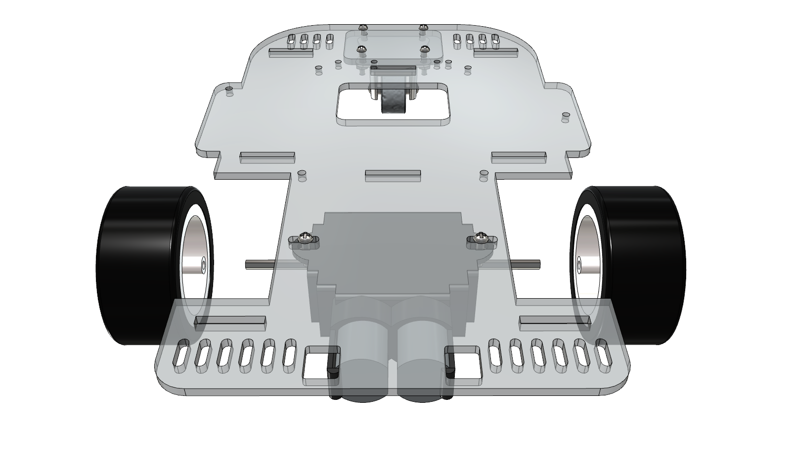

# マイコンをマウントするネジの取り付け

* 使用ネジ（ポリカ M2.6-15ｍｍ）2本

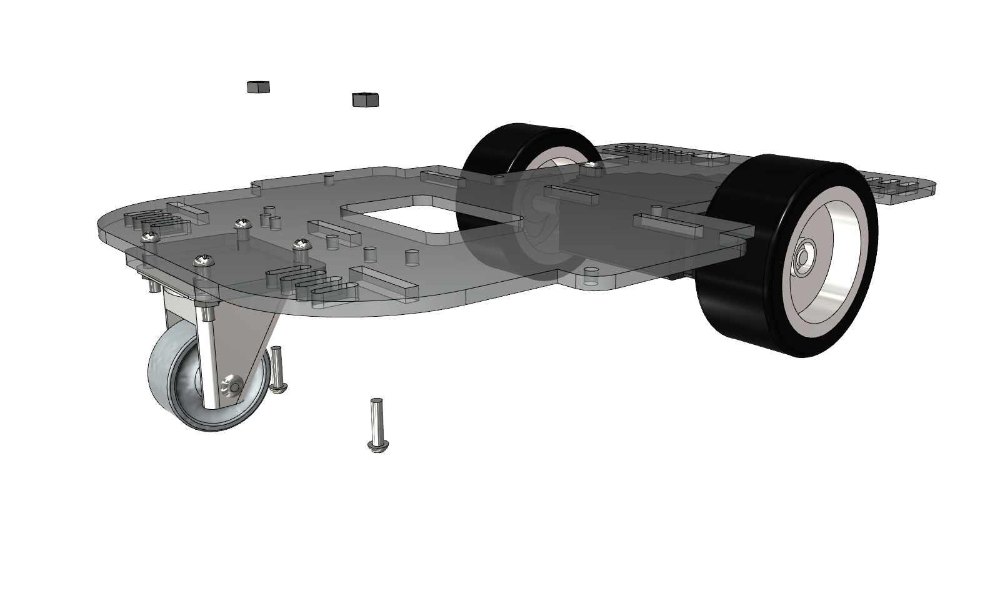

ゴムクッションを取り付けます。

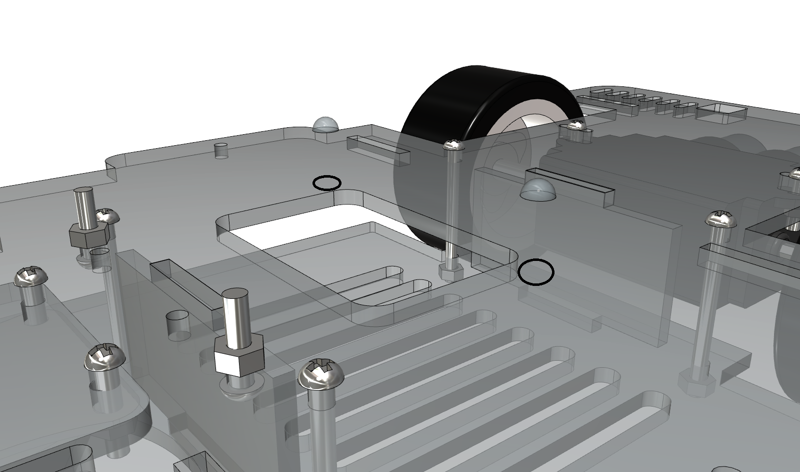

# シャーシ下部の取り付け

* 使用ネジ（M3-35ｍｍ）4本

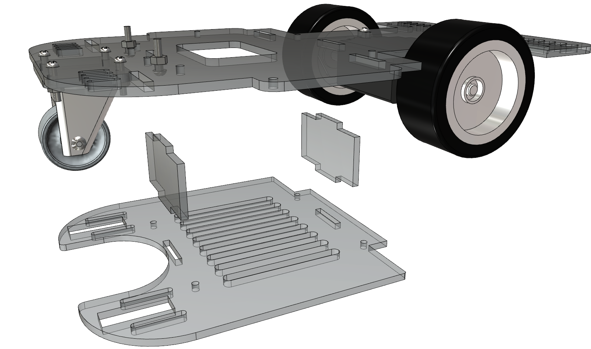

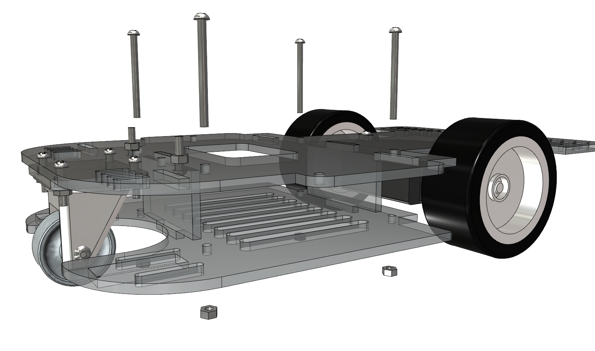

# 完成図

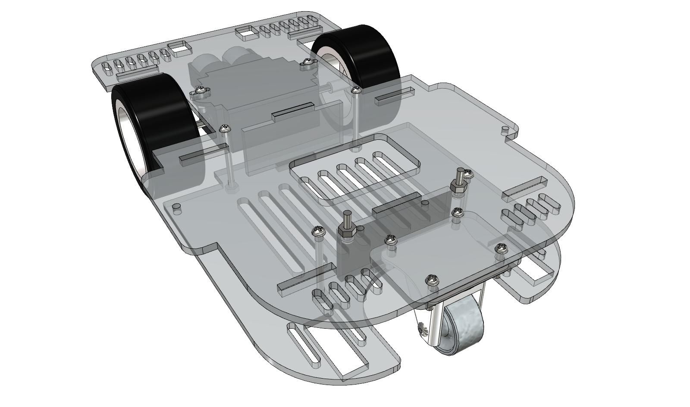

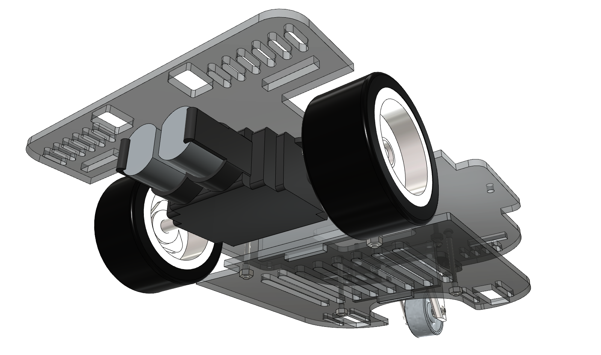
