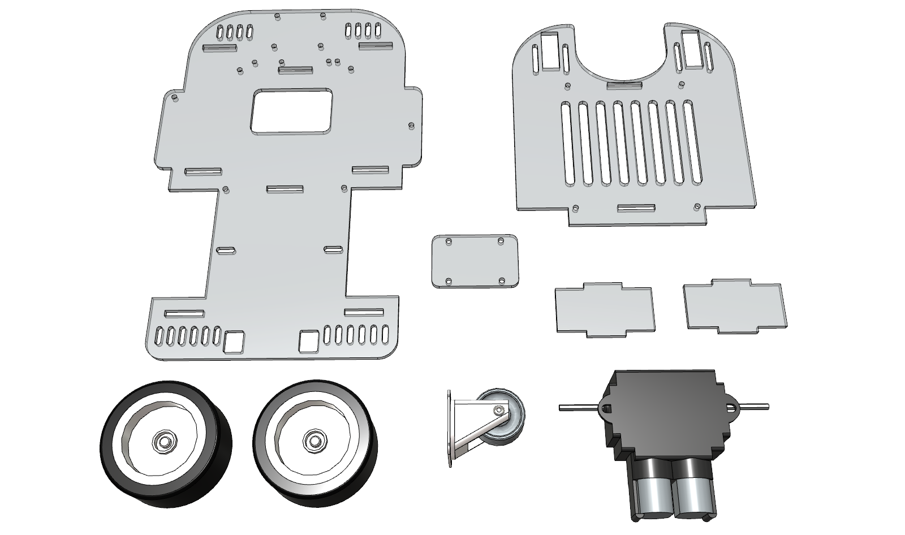

# Mouse

## 組み立てマニュアル

主な構成パーツ

＊＊＊　注意　＊＊＊

仕様変更に伴い、構成パーツや組み立て方法が変わる場合があります。
あらかじめご了承ください。

# モーターギヤボックス前準備

ギヤ比は 114.7 : 1　組み立てます。

モーターは付属のモーターから、6Vモーターに取り替えます。

[画像準備中]

完成図

[画像準備中]

# タイヤ前準備

前タイヤと後タイヤを各２本、計４本準備します。

前タイヤはゴム枠だけ組み立てます。

後タイヤはシャフト取り付け治具まで組み立てます。ホイール内部が浅いほうが内側になります。

マウス型ロボカー組み立てマニュアル
