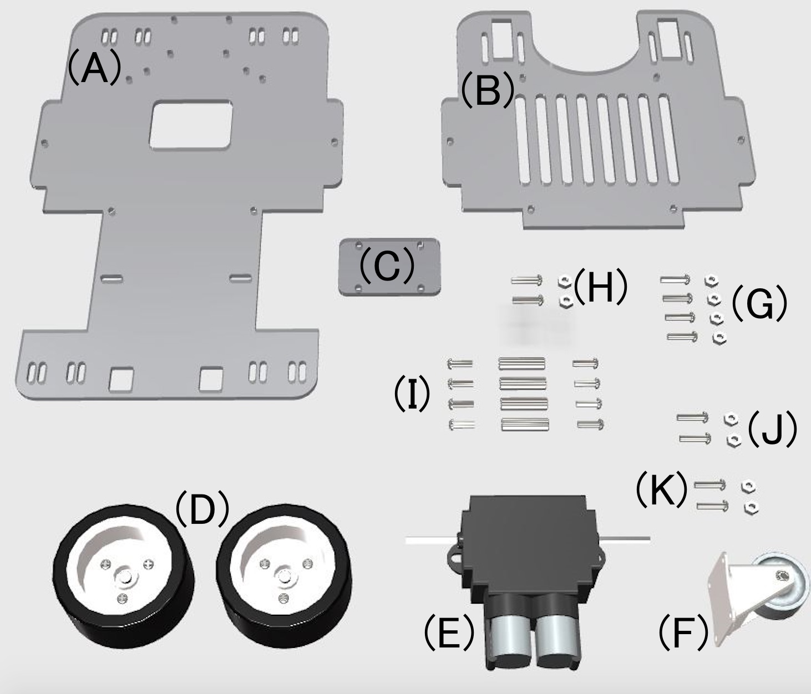
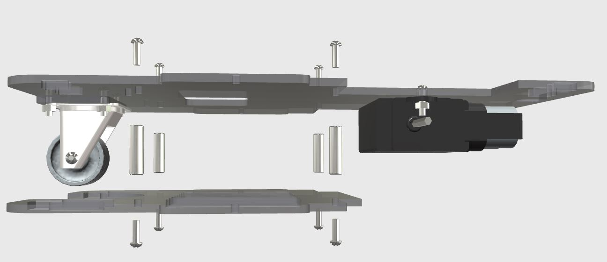
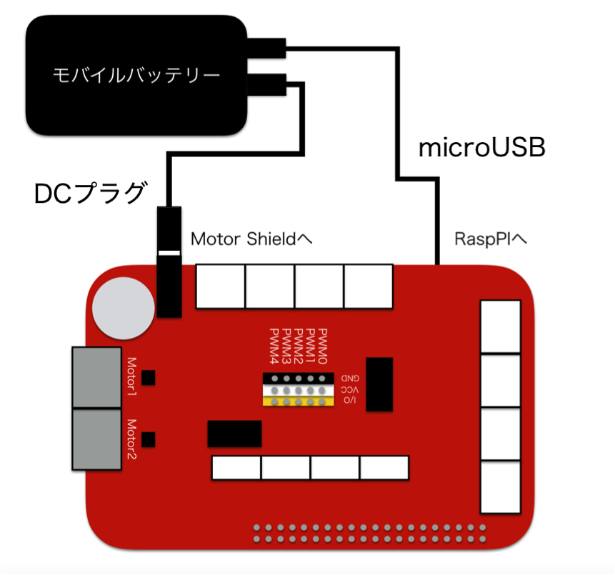

# マウス型ロボカー

## 組み立てマニュアル

2020年1月版

主な構成パーツ

(A) シャーシ上部

（B） シャーシ下部

(C) アジャスター

(D) タイヤ

(E) モーターギヤ

(F) キャスター

(G)(H)(J) M３ネジ、ナット

（I) M３ネジ、スペーサー

(K) M２．６ネジ、ナット

＊＊＊　注意　＊＊＊

組み立てる前に構成パーツが欠品していないか確認してください。

小さいパーツなど、失くさないよう注意してください。

強い衝撃を与えないでください。

尖った部分で怪我をしないよう取り扱いに注意してください。

仕様変更に伴い、構成パーツや組み立て方法が変わる場合があります。
あらかじめご了承ください。

# モーターギヤボックス前準備

ギヤ比は 114.7 : 1　組み立てます。

モーターは付属のモーターから、6Vモーターに取り替えます。

※２個用意します。

完成図

# タイヤ前準備

2個作ります。

タイヤはシャフト取り付けまで説明書を参考にして組み立てます。

シャフト取り付けパーツは　3mm六角用　を使用します。

ホイール内部が浅いほうが内側になります。

# 前キャスターの取り付け

* 使用ネジ　(G) M３ネジ、ナット　4本

シャーシ上部、アジャスター、キャスターの順番で取り付けます。

# モーターギヤの取り付け

* 使用ネジ (H) M３ネジ、ナット　2本

モーターギヤの方向に注意してください。

取り付けたシャーシ上部にある２つの穴からモーターのリード線を出します。

# タイヤの取り付け

# マイコンをマウントするネジの取り付け

* 使用ネジ (K) M２．６ネジ、ナット）　2本

ゴムクッションを取り付けます。

# シャーシ下部の取り付け　
##２０２０／01／08変更点

* 使用ネジ （I) M３ネジ、スペーサー　4本

スペーサーを挟む様に上下からネジで固定する。

# バッテリーの取り付け

FaBoの彫刻がある方からバッテリーを差し込みます。

落下防止用ネジを取り付けます。

* 使用ネジ (J) M３ネジ、ナット　2本

# マイコンとモーターシールドの取り付け

マイコン固定用のネジに合わせて上から載せます。

取り外しが容易にできるよう、ナットでの固定はしません。

# 配線について

モバイルバッテリーより給電するために配線を行います。

白のUSBケーブルはMotor Shieldのジャックに接続し、黒のUSBケーブルはRaspberryPIのUSBポートにそれぞれ接続します。

制御するDCモーターを接続します。

ShieldのMotor1、Motor2のコネクタに対して、それぞれ黄色い線が中央になるようにモーターを接続します。

モーターの線は、Shield側のコネクタ上部の白い部分を押す事で差し込むことができます。

# 距離センサーマウントの取り付け

# バックブリックマウントの取り付け

# 完成図

