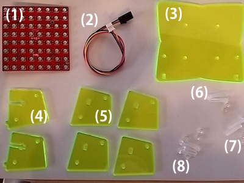
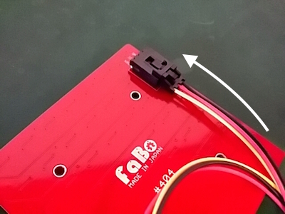
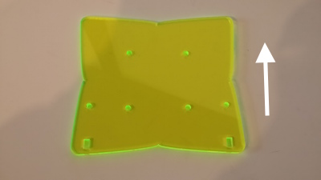
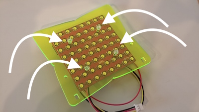
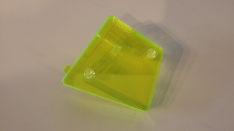
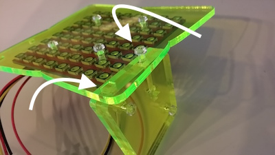
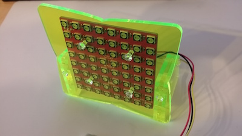

# #1502 Matrix Plate Kit

  
![].(/img/1502_matrix_plate.jpg)
<!--COLORME-->

注文を受けてから生産しますので、納期にお時間をいただく場合があります。

## Overview
Matrix Plate Kitは、#404 ColorLED Matrixを直立させるためのキットです。

**このキットには「#404 ColorLED Matrix」、「＃1301 3pinケーブル」 は、含まれませんのでご注意下さい。**

**デザインは予告なく変更される場合があります。**

**マニュアルで使われている写真のパーツと、実際のパーツの色や形が異なる場合があります。あらかじめご了承ください。**

**注意：ネジを必要以上にキツく締めるとパーツが破損する可能性があります。**

##パーツ構成

(1)MatrixLED本体（別売）

(2)3Pinケーブル（別売）

(3)~(5)アクリルパーツ

(6)M3-12mmネジ4本、M3ナット4個（プラ）

(7)M3-18mmネジ2本、M3ナット2個（プラ）

(8)M2.6-10mmネジ4本、M2.6ナット4個（プラ）

### 1.MatrixLEDに3Pinケーブルを取り付けます。

### 2.アクリルパーツ(3)にMatrixLEDを取り付けます。

矢印の方向が上になります。

使うネジは（8）M2.6−1０mmのネジです。

### 3.足パーツをつくります。

アクリルパーツ(5)にM3ナットを取り付け、アクリルパーツ(4)を２枚で挟むように固定します。

固定に使うネジは（6）M３−12mmのネジです。これを２個つくります。
### 4.手順１で作ったパーツに手順２で作ったパーツを取り付けて完成です。

使うネジは（７）M3−2０mmのネジです。

## Github

https://github.com/FaBoPlatform/FaBo/tree/master/1502_matrix_plate

