# #1503 SmartLight Kit

  
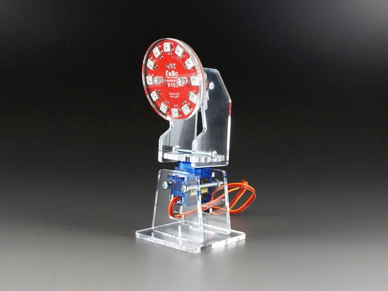
<!--COLORME-->

注文を受けてから生産しますので、納期にお時間をいただく場合があります。

## Overview
SmartLight Kitは、「#402 ColorLED Ring」用のキットで、照明の向きを制御できるようになります。

**デザインは予告なく変更される場合があります。**

**マニュアルで使われている写真のパーツと、実際のパーツの色や形が異なる場合があります。あらかじめご了承ください。**

**注意：ネジを必要以上にキツく締めるとパーツが破損する可能性があります。**

**このキットには「#402 ColorLED Ring」、「#1301 3pinケーブル」 は、含まれませんのでご注意下さい。**

## パーツ構成　RingLED部分

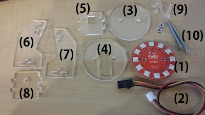

(1)#402 ColorLED Ring Brick（別売）

(2)3Pinケーブル（別売）

(3)~(8)アクリルパーツ

(9)M3-20mmネジ２本、M3ナット２個（プラ）

(10)M3-35mmネジ２本、M3ナット２個（鉄）

### 1.RingLEDに3Pinケーブルをつなげます。

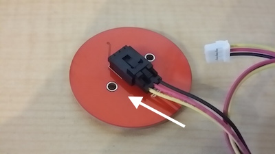

### 2.アクリルパーツ(3)と(4)でRingLEDを挟みます。

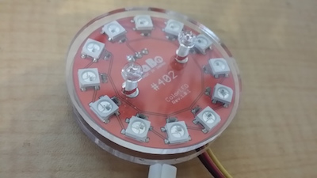

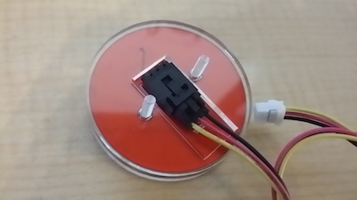

(3)が手前になります。(4)は裏で、ケーブルの向きに合わせて、四角の穴が下寄りの向きになります。

手前からプラネジを通しておきます。

### 3.アクリルパーツ(5)を取り付けます。

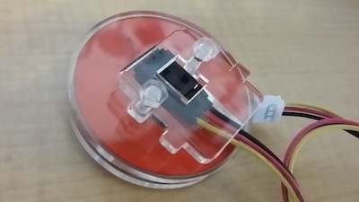

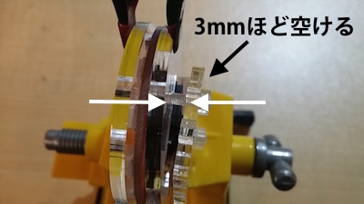

ナットは**軽く回して**取り付けます。写真のように、アクリルパーツ(4)と(5)の間を3mm程度空けておきます。

### 4.アクリルパーツ(6)(7)(8)を取り付けます。

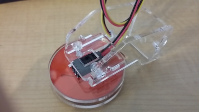

(6)と(7)で、(5)と(8)を挟むように取り付けます。

（手順３）アクリルパーツ(4)と(5)の間に3mm以上の隙間がないと取り付ける事ができないので注意してください。

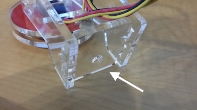

(8)のサーボギア取り付け穴は前寄りになるように取り付けます。

### 5.ネジで固定します。
M3-35ネジで固定して完成です。

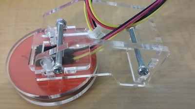

## 土台部分

パーツ構成　Kadenキット土台部分

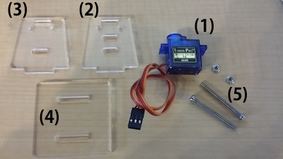

（１）サーボ、(2)~(４)アクリルパーツ、（５）M3-35mmネジ２本、M3ナット２個（鉄）

### 1.アクリルパーツ(2)と(3)でサーボを挟みます。

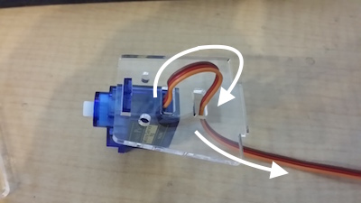

アクリルパーツ(2)をサーボギア寄り面にセットします。サーボのリード線を写真のように穴に通します。

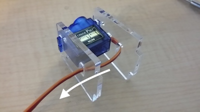

アクリルパーツ(3)をサーボギアの反対面にセットします。サーボのリード線を写真のように穴に通します。

### 2.ネジで固定します。

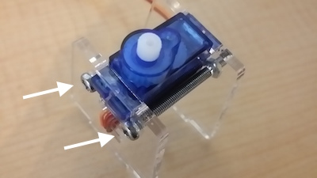

### 3.底板をセットします。

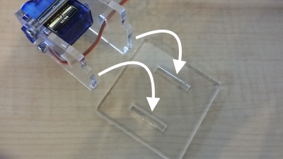

はめるだけですが、お好みで接着固定してください。

## 土台完成

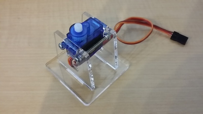

## Github

https://github.com/FaBoPlatform/FaBo/tree/master/1503_smartlight
