# #1504 RemoteController Kit

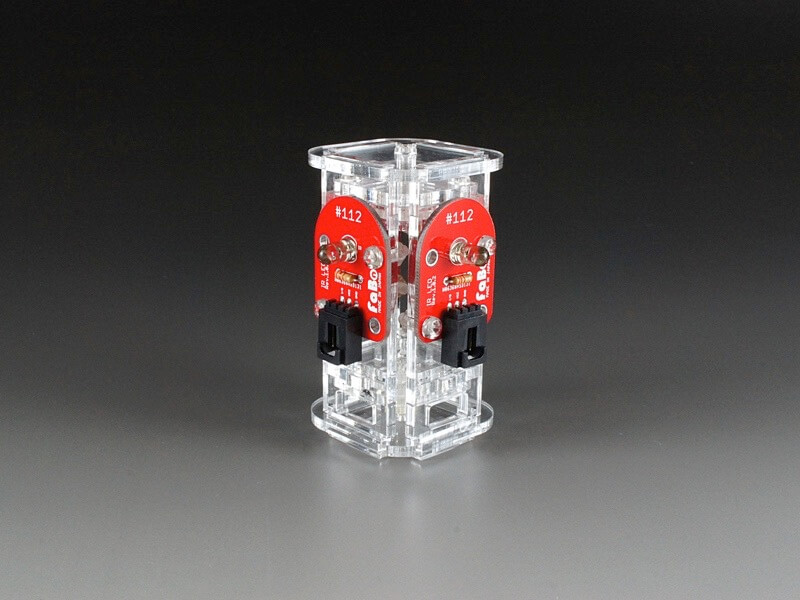
<!--COLORME-->

注文を受けてから生産しますので、納期にお時間をいただく場合があります。

## Overview
RemoteController Kitは、「#112 IR LED Brick」用のキットで、前後左右の方向に対して赤外線による信号を発信することができるようになります。

**このキットには「#112 IR LED Brick」、「#1301 3pinケーブル」 は、含まれませんのでご注意下さい。**

**デザインは予告なく変更される場合があります。**

**マニュアルで使われている写真のパーツと、実際のパーツの色や形が異なる場合があります。あらかじめご了承ください。**

**注意：ネジを必要以上にキツく締めるとパーツが破損する可能性があります。**

## パーツ構成

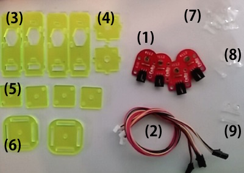

(1)#112 IR LED Brick 4個（別売）

(2)3Pinケーブル 4本（別売）

(3)~(６)アクリルパーツ

(7)M3-10mmネジ8本、M3ナット8個（プラ）

(8)M3-12mmネジ4本、M3ナット4個（プラ）

(9)M3-20mmネジ2本、M3ナット2個（プラ）

### 1.IR LEDと3Pinケーブルをつなげます。
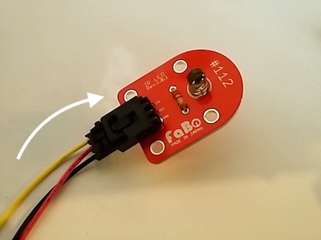

使うネジは（７）１０mmのネジです。

### 2.IR LEDをアクリルパーツ(3)に取り付けます。
アクリルパーツ(4)は以下の写真状態が正面になります。（ネジ穴が右上にある事）

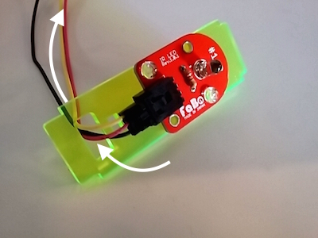

アクリルパーツ(3)の下部にある穴に3Pinケーブルを通します。

これを３個作ります。

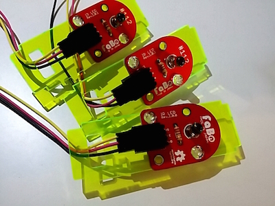

最後の１個は、下部の穴を通さないでおきます。これが背面になります。

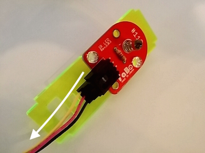

### 3.中パーツを作ります。
アクリルパーツ(4)の中心にM３ナットを添えて、アクリルパーツ(5)２枚つかい挟むように固定します。

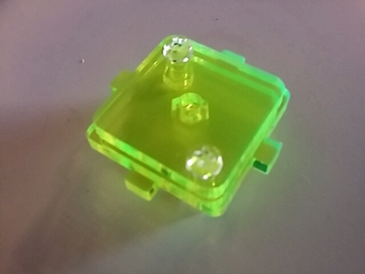

使うネジは（８）１２mmのネジです。これを２個つくります。

### 4.手順２で作ったパーツ４個で、中パーツ２個を囲むようにセットします。

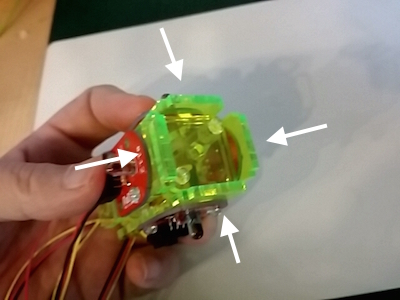

### 5.上部をアクリルパーツ(6)で固定します。
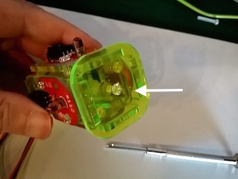

### 6.ケーブルを穴に通します。
下部の穴にケーブルを通します。手順２の最後に作ったパーツの穴に、３本通します。

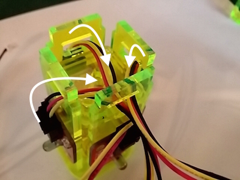

### 7.下部をアクリルパーツ(6)で固定して完成です。

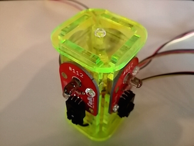

## Github

https://github.com/FaBoPlatform/FaBo/tree/master/1503_smartlight
