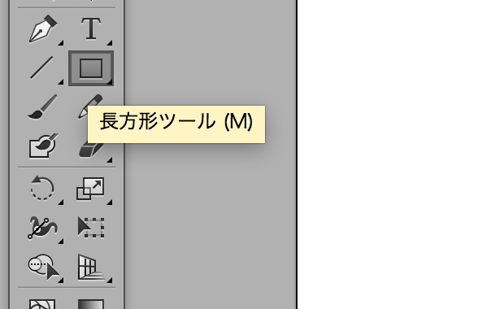
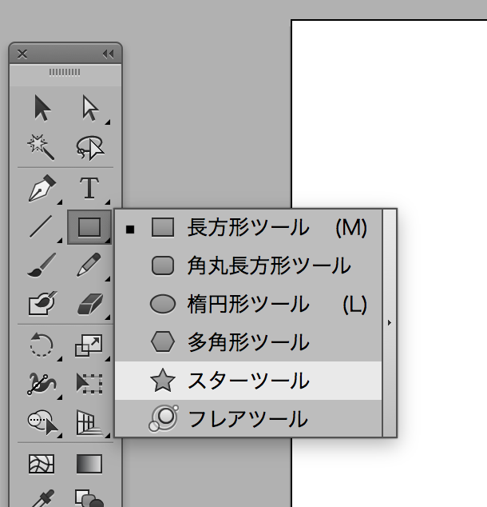
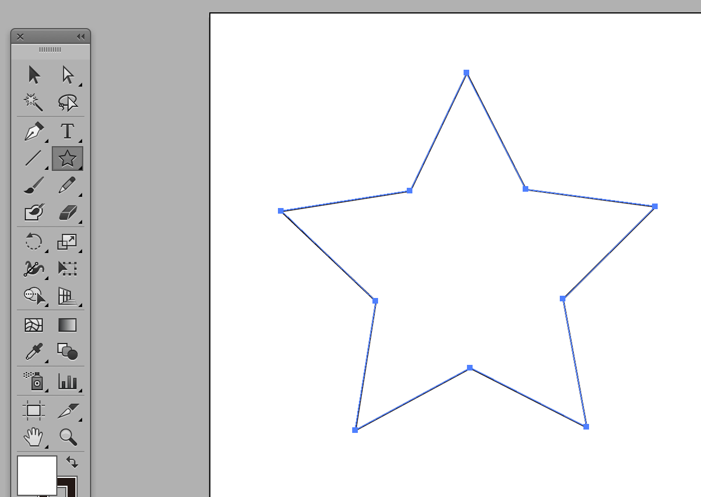
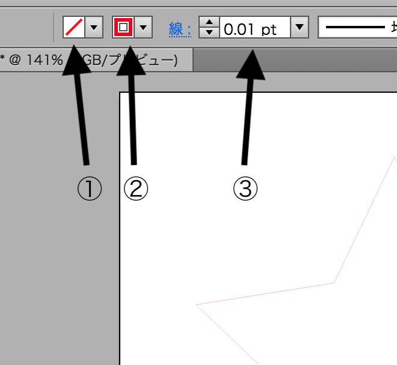

# レーザーカッター

## レーザーカッターとは

レーザーを使用した加工機で、画像処理ソフトで作成されたデータを元に、木材やアクリルなどの素材に対して切断、彫刻することができる機器です。

## レーザーカッターの仕組み

レーザー発振器から出力されたレーザーをレンズで細く絞って切断材料に照射することで局部的に溶融させ、近くに接続されているノズルから補助ガスを噴き付けて溶融物を噴き飛ばすことで狭い幅の高精度な切断を行っています。

## レーザーカッターの利点

高精度の切断、彫刻ができる。

加工するスピードが早い。

データが１つあれば複数作成することができる。

## 過去に加工を行った素材
・加工できるもの

MDF板 / ベニヤ板 / コルク / ダンボール / 紙、厚紙 

アクリル板 / ポリプロピレン / 布 

ゴム板 / カーボン(彫刻のみ)

・加工できないもの

金属類(高出力レーザーであれば金属加工も可)

・レーザーカッターで加工してはいけないもの

ポリ塩化ビニル

 有毒ガスが発生し、レーザーカッター故障の原因にもなります。

鏡（反射率が高いもの） 

 レーザーを反射してしまい、事故の原因になります。

## レーザーカッター用の画像処理ソフトの準備

レーザーカッター用の画像作成には、Adobe IllustratorまたはInkscapeという画像処理ソフトを使用します。

## レーザーカッター注意事項

レーザーカッターは使用方法を誤ると、発火や怪我、失明など危険があります。 

注意点を記述しますので、必ず守ってください。

### 1. 本体側面の正面側についている蓋を開けて使用しない。 

素材等によりレーザーが反射し、怪我をする恐れがあります。

### 2. レーザーで実際に作業を行う際はコンプレッサー、集塵機の電源を入れる。 

レーザーにてカットした際に発生するガスに引火する可能性があります。 

また、作業が終わったらそれぞれの電源を切ること。

### 3. レーザーカッターの電源を入れた後は、ヘッドの動きが終わるまで手を入れない。 

電源をいれた直後は初期動作によりヘッドが移動します。 

その際に怪我をする可能性があります。

### 4. レーザーで加工する素材は塩化ビニル系のものは絶対に使用しない。 

塩化ビニル系の素材をカットした際に発生するガスでレーザーカッターが破損する可能性があります。

### 5. 「オートフォーカス」機能を使用する際、レーザーの横についているピンの下に素材が置いてあることを事前に確認する。 

素材を乗せる台が上がりすぎてしまいレーザーカッターが破損します。 

なお、紙などの柔らかい素材を使用する場合、オートフォーカスを行わずに手動で高さ調整をします。

## 環境設定

Adobe Illustratorのインストール 

下記のリンクからIllustratorの無料体験版をインストール 

http://www.adobe.com/jp/products/illustrator.html

※ダウンロードにはAdobeのユーザー登録が必要になります。

## イラストレーター 新規ドキュメント作成

Illustratorを起動したら、新規ドキュメントを作ります。 メニューから「ファイル」ー「新規」を選びます。

新規ドキュメントの窓が出てきたら、プロファイルの設定を行います。 幅、高さ、裁ち落としなどの設定を以下の様に変更します。

・幅　　　　　635mm

・高さ　　　　458mm

・裁ち落とし　　 0mm 

・カラーモード　　　RGB

・ラスタライズ効果　高解像度(300ppi)

※使用するパソコンやバージョンによって表示が違う場合があります。

設定ができたら「OK」のボタンをクリックします。 

## イラストレーターで星を書いてみましょう。

まずアイコン一覧にある「長方形ツール」を長押しします。

すると長方形以外を選択できるので、スターツールを選択します。

キャンパスでカーソルをドラッグ＆ドロップすると星を描画します。

次に書いた星（線）をレーザーカッターで切り出すための切断用データに変換します。

変換したい線を選択したら、線の情報を変更します。

１.塗りつぶしカラーを「なし」にします。

2.線カラーを「赤」にします。

3.線幅を「0.01」にします。

これで切断用のデータに変換できました。

